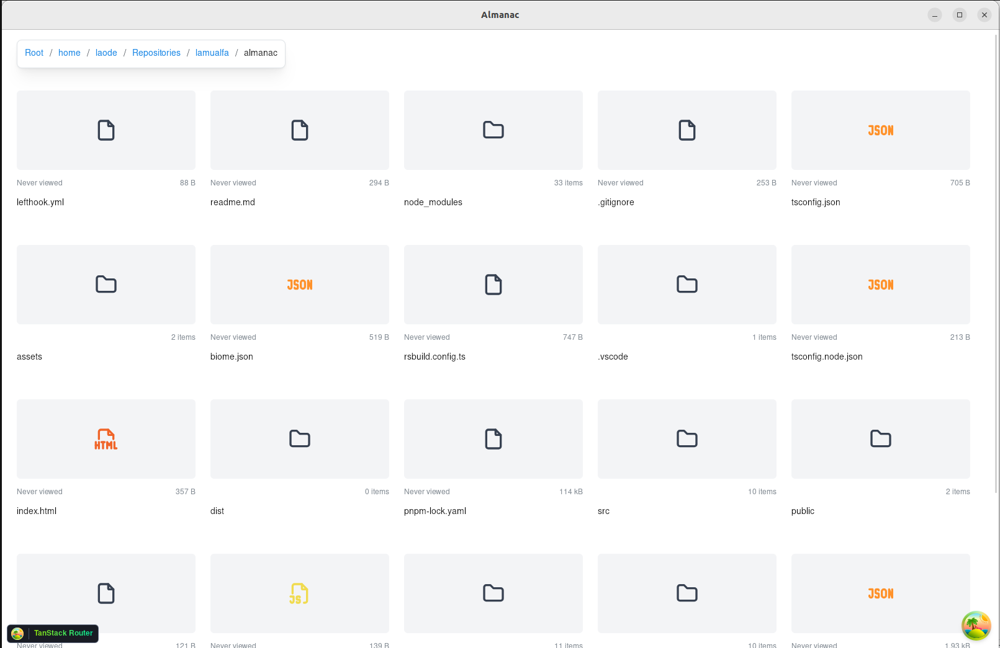

<p align="center">

</p>

<h1 align="center">Almanac</h1>

<p align="center">
 📁 Dead simple File Manager with <b>Local Views Count</b> Feature!
</p>

<br>

<p align="center">


</p>

<br>


<br>

## Features

- Tracks how many times you open a file.
> 🌽 In-case u have hundreds of local videos to watch :)
- Thumbnail/preview for image/video files.
- Use custom **RUST** functions on file-system related features for better performance.

## Possible Upcoming Features

- Better thumbnail/preview generation.
- Search files/folders.
- Sort files/folders by views.
> 🌽 No-guess in finding ur favorite videos ever :)
- Showing **Home**, **Downloads**, **Videos** & **Removable Disks** on starting page instead of **Root**.
- Refresh button for thumbnail/preview.

## Unplanned Features

- Basic file operations: Copy, Move, Delete, and Rename.
- Thumbnail/preview for files other than images/videos.
> 🌽 Who's using this to open documents anyway? Go watch some videos! :|
- Re-design the **UI**
- Change the **Icon**
- 🍎 Support for Apple ecosystem
> Let's support 🌽 instead!

## Download

Build on ur own. Sorry :)


## Tech Stack

- [Tauri](https://tauri.app/): **RUST** based cross-platform framework
- [RsBuild](https://rsbuild.dev/): **RUST** based bundler
- [Biome](https://biomejs.dev/): **RUST** based formatter & linter
- [Tanstack Router](https://tanstack.com/router/latest)
- [Tanstack Query](https://tanstack.com/query/latest) to handle async invoking to **RUST** functions
- [Mantine UI](https://mantine.dev/)
- [React Window](https://github.com/bvaughn/react-window) to render large grids of files/folders
- [Specta](https://github.com/specta-rs/specta) to generate typesafety bindings
- [Static FFMPEG](https://johnvansickle.com/ffmpeg/) to generate images/videos thumbnail
> [FFMPEG Thumbnailer](https://github.com/dirkvdb/ffmpegthumbnailer) produces better thumbnail/preview, but I don't know how to build it LOL.

## Development

```bash
pnpm install
pnpm tauri dev
```

> Don't run `pnpm dev` directly!